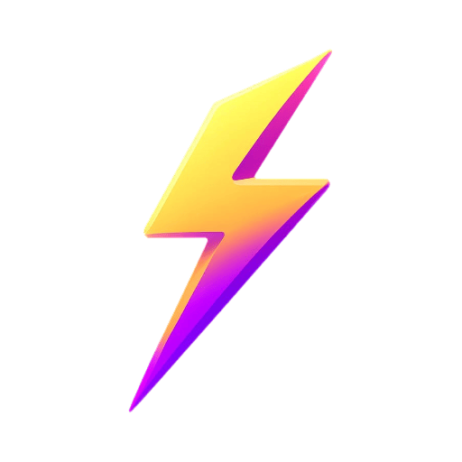

<!-- PROJECT LOGO -->
<br />
<div align="center">
    

  <h3 align="center">SuperDuper App</h3>

  <p align="center">
    An alternative ebike app.
    <br />
    <a href="https://discord.gg/STvgARZYaw"><strong>Join the Discord</strong></a>
    <br />
    <br />
    <a href="https://testflight.apple.com/join/Tl0UibRY">iOS Download</a>
    ·
    <a href="https://play.google.com/store/apps/details?id=io.kbl.superduper">Android Download</a>
    ·
    <a href="https://github.com/blopker/superduper/issues">Bug Reports</a>
  </p>
</div>
<br/>

Features:

- No account or internet connection required
- Quickly switch between multiple bikes
- Lock settings, like Mode, to automatically switch when the bike is turned on and the app is running
- (Android only) Background Lock, which will keep your bike on whatever settings you set it at, even the phone is locked
- Open source

## Getting Started

- Open the app and select the "Select Bike" button. This will find any bikes around you that are on and save the details into the app.
- Select your bike in the list.
- Set the settings you want to use. These can be changed at any time.

Optionally, you can tap the "Edit" button to change the name of the bike.

**Make sure your bluetooth is on**

## Bike Functions

Control your bike's functions by tapping the buttons on the screen. Press the lock icon to lock the setting.
A locked setting tells the bike to use that setting when it turns on. An unlocked setting will reset to the default
when the bike turns on.

### Light

If your bike has them, this toggles your bike's lights on and off.

### Mode

Changes the legal category your bike will operate at. PAS is Pedal Assist System,
which means the motor will only run when you are pedaling.
Throttle means the motor will run when you press the throttle, regardless of if you are pedaling or not.

#### US:

| Mode | Class | PAS | Throttle | Speed Limit |
| ---- | ----- | --- | -------- | ----------- |
| 1    | 1     | Yes | No       | 20 mph      |
| 2    | 2     | Yes | Yes      | 20 mph      |
| 3    | 3     | Yes | No       | 28 mph      |
| 4    | Off-Road | Yes | Yes  | No Limit    |


#### EU:

| Mode | Class | PAS | Throttle | Speed Limit |
| ---- | ----- | --- | -------- | ----------- |
| 1    | EPAC  | Yes | No       | 25 km/h     |
| 2    | 250W  | Yes | No       | 35 km/h     |
| 3    | 850W  | Yes | No       | 45 km/h     |
| 4    | Off-Road | Yes | Yes  | No Limit    |

### Assist

Changes the amount of assist your bike will provide while pedaling.
0 is no assist, 4 is full assist. This does not affect throttle power.

### Background Lock (Android Only)

**Uses extra battery.** Locks the current "locked" settings in the background. This means that if you close the app, or your phone goes to sleep, the settings will continue to be applied.


## FAQ

### The app won't connect to my bike

Make sure your bike is on and your bluetooth is on. If you're on Android, make sure the app has location permissions. If you're on iOS, make sure the app has bluetooth permissions. Additionally, on some devices GPS needs to be enabled for scanning to work.

Make sure only one app is connected to the bike at a time. If you have the official app open, disconnect from the bike within the app, and close it. It can also help to uninstall the official app.

You can also try restarting the bike and your phone.

Finally, older bike firmware may not be supported. Make sure your bike firmware is up to date from the official app.

### How does Background Lock work and how is it different from the setting lock?

The setting lock feature tells Superduper to ignore whatever the bike is set to and use the settings you have set in the app. This is useful for when the bike starts up and settings reset, like lights and mode. However, the app only enforces the setting lock when the app is open. If you close the app, the bike will go back to whatever settings it was set to. To use it, long press the setting button you want to lock.

Background Lock is a feature that will keep the bike on the settings you set in the app, even if the app is closed. This is useful for when you want to leave the bike on a certain setting, like lights and mode, but don't want to keep the app open. For now, this feature is only available on Android. It also takes extra battery to keep the app running in the background.

### What's up with the bike names?

The bike names are randomly generated from your bike's unique ID, to make it easier to read and differentiate between multiple bikes. You can change the name in the bike's Edit page after you connect to the bike for the first time.

### What are the supported devices?

Right now the app requires Android 10+ and iOS 12+.

### What bikes are supported?

So far, all bike models have worked. Open a ticket if your model is having issues!

### Can this app make the bike go even faster?

Superduper can only add automation around what the official app already does. It cannot, for instance, program the controller. This is the job of the firmware, software that runs on the bike itself.

### I'm having another issue or have a feature request

I'm sorry! Please start by making sure you have the newest app from the app store. After that, please submit the issue to https://github.com/blopker/superduper/issues. It helps to have a way I can reproduce the issue, with screenshots or video. Alternatively, you may have luck either clearing all the app's data or reinstalling it.

## Developers

### Architecture

The app uses a modern, decoupled architecture that allows connecting to multiple bikes simultaneously:

#### Key Components

- **BikeModel**: Data class representing a bike's state and settings
- **BikeService**: Manages connection and communication with a single bike
- **BikeRepository**: Stores bike data and manages BikeService instances
- **BikeConnectionManager**: Orchestrates connections to multiple bikes

#### How It Works

1. The app maintains independent BikeService instances for each bike
2. Active bikes automatically connect when the app starts
3. Bike connections are managed in the background, independent of UI
4. Each bike service manages its own connection lifecycle

This architecture enables users to seamlessly switch between multiple bikes while maintaining connections to all active bikes.

#### Migration from Previous Versions

When upgrading from older versions of the app:

1. The app automatically migrates bike data to the new format on first launch
2. All previously saved bikes will be preserved with their settings
3. Active status is automatically assigned to all migrated bikes

If you experience any data migration issues, you can manually trigger migration:
```dart
final migrationUtil = ref.read(migrationUtilProvider);
await migrationUtil.migrateIfNeeded();
```

### Development

#### Build and Run

To build and run the app after cloning the repository:

```bash
# Install dependencies
flutter pub get

# Generate code (required after cloning or making changes to models)
flutter pub run build_runner build --delete-conflicting-outputs

# Run the app
flutter run
```

### Releases

1. Update version, save. Don't commit.
1. Run `make release`
1. Update release notes at provided URL.
1. Upload aab to https://play.google.com/console/u/0/developers/6048825475784314007/app/4973912181639360195/tracks/internal-testing
1. Upload ipa to the Transporter app
1. Release Android on Play store
1. Release iOS on https://appstoreconnect.apple.com/apps/1665290602/appstore/ios/version/inflight
